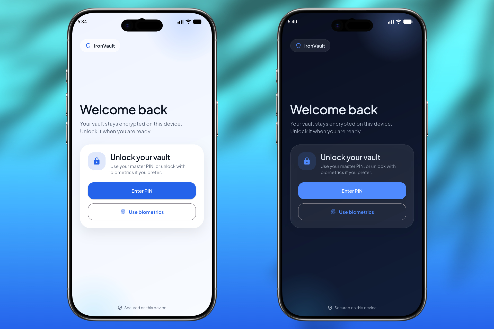
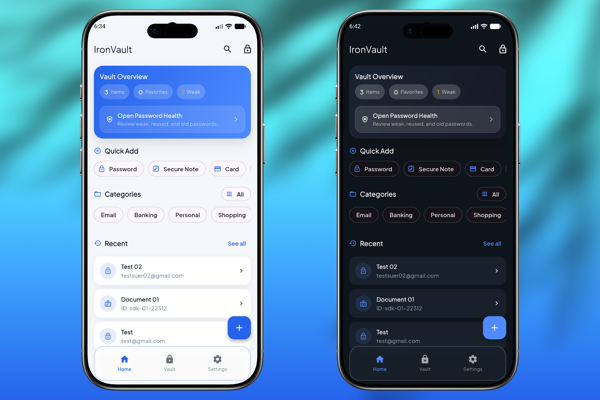
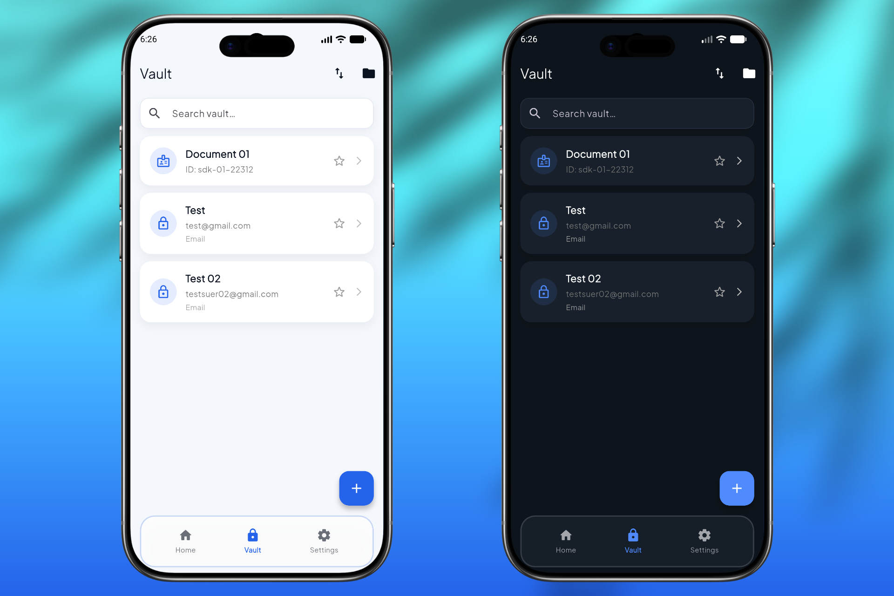
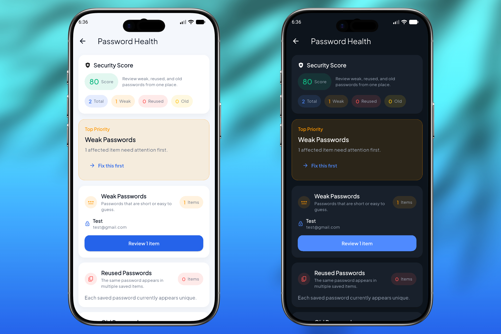
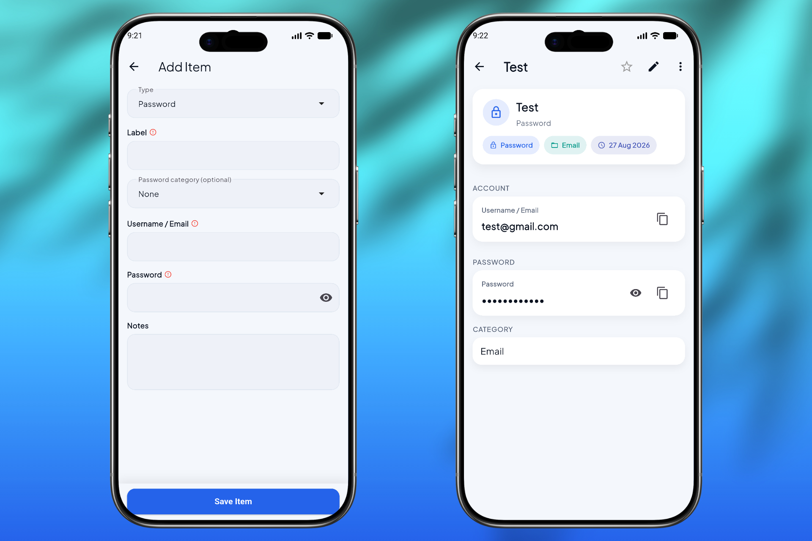
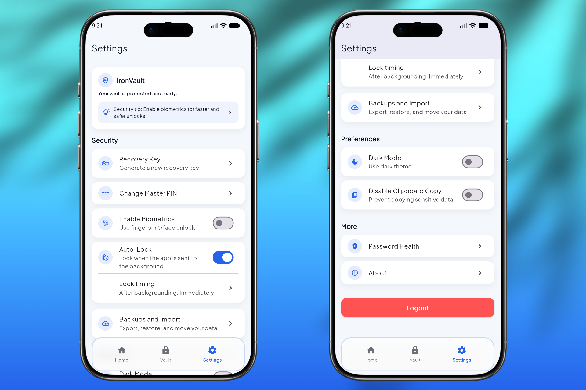

# IronVault

IronVault is an offline-first private vault built with Flutter.  
It stores vault data locally on the device and protects it with strong encryption and app-level authentication.

## Project Overview
- Local-first vault for passwords and sensitive records
- Master PIN authentication with optional biometric unlock
- Welcome screen plus dedicated keypad-based PIN unlock flow
- Encrypted storage for vault entries
- Onboarding focused on local privacy, secure unlock, and recovery-key safety
- Android document scan/import support
- Add-item draft restore to preserve unsaved progress after lock/interruption
- Manual and startup update checks via GitHub Releases
- In-app privacy, update, issue-reporting, and share-app links from the About screen

## Recent Highlights
- Performance optimization for tab navigation by caching local encrypted vault queries.
- Biometric auth prompt cancellation fixes to avoid unwanted PIN prompt fallbacks.
- Simplified 3-tab navigation (Home, Vault, Settings) with universal search sheet and inline list search.
- Credential detail screen app bar decluttering using a 3-dots overflow action menu.
- Recovery-key management now uses re-authentication and an explicit in-screen generation flow.

## Screenshots

<table>
  <tr>
    <td align="center"><b>Login</b><br></td>
    <td align="center"><b>Vault Home</b><br></td>
  </tr>
  <tr>
    <td align="center"><b>Password List</b><br></td>
    <td align="center"><b>Password Health</b><br></td>
  </tr>
  <tr>
    <td align="center"><b>Add / Edit Item</b><br></td>
    <td align="center"><b>Settings</b><br></td>
  </tr>
</table>

## Key Features
- Vault item types:
  - Passwords
  - Bank accounts
  - Cards
  - Secure notes
  - Documents
- Search and filtering
- Category support with rename propagation across existing saved items
- Password health scoring with actionable review cards for weak, reused, and old passwords
- Auto-lock with configurable timer and app-switch behavior
- Recovery key flow for PIN recovery with protected reveal
- Recovery key setup that can be resumed until the user confirms it has been saved
- Recovery key management from Settings with re-authentication and manual in-screen generation
- PIN retry cooldown after repeated failed attempts
- New-item draft restore and keep/discard draft prompt on exit
- Encrypted backup restore plus CSV password import/export
- Pull-to-refresh on Vault, Search, and Password Health screens
- One-tap deep links from Password Health into filtered affected items

## Security Model
- Vault data is encrypted before storage
- Master PIN is stored as a hash, not plain text
- Optional biometric auth uses platform APIs
- IronVault does not use cloud sync
- Recovery key is hidden by default and requires re-authentication before reveal
- Recovery key reveal supports biometrics or PIN fallback
- Recovery key raw value is only kept temporarily until the user confirms it has been saved
- Repeated wrong PIN attempts trigger a persistent cooldown
- Clipboard clearing is supported for copied sensitive fields
- Android screenshot and recents-preview protection is enabled at the activity level
- Screenshot/privacy behavior can still vary by platform and OEM implementation
- Sentry crash reporting is enabled for release builds with safe metadata capture

## Ownership, License, and Brand Use
This repository is licensed under MIT for source code reuse as defined in `LICENSE`.

Important:
- The MIT license covers code.
- The project name **IronVault**, logo, icon, and brand assets are not granted as a trademark license.
- If you fork or redistribute, use your own app name, package ID, and branding.

## Tech Stack
- Flutter
- Dart
- Riverpod
- Drift (SQLite) for vault items
- sqflite for category storage
- flutter_secure_storage
- local_auth
- AES-based encryption utilities

## Supported Platforms
- Android: supported
- iOS: code exists but not production-validated in this repo

## Run Locally
```bash
flutter pub get
flutter run
```

## Build Release
APK:
```bash
flutter build apk --release
```

AAB:
```bash
flutter build appbundle --release
```

Output paths:
- `build/app/outputs/apk/release/ironvault-v<version>.apk`
- `build/app/outputs/bundle/release/app-release.aab`

## Versioning
Version is maintained in `pubspec.yaml`:
- `versionName` comes from `version`
- `versionCode` comes from the build number suffix
- Current release target: `1.0.25+26`

Use Git tags for releases:
- Tags follow the app version format in `pubspec.yaml` (for example `v1.0.25`).

## GitHub Actions (CI/CD)

Workflows live under `.github/workflows/`.

### Continuous integration
- **Flutter Analyze** runs on every **push** and **pull request** to `main`: checks out the repo, runs `flutter pub get`, then `flutter analyze`.

### Automated release APK
- **Release APK** runs when you **push a tag** whose name starts with `v` (for example `v1.0.25`), and it can also be started manually from the **Actions** tab in GitHub.
- The job restores Android release signing from **repository secrets** (never committed): base64-decoded keystore under `android/app/keystore.jks` and `android/key.properties` generated in the runner.
- It runs `flutter build apk --release`, stages the release artifact as `ironvault-<tag>.apk` (preferring the Gradle `apk/release` output when present), runs a short **verify** step (`apksigner` / `aapt` when available), then **creates or updates a GitHub Release** for that tag and uploads the APK.
- **Release notes** for the GitHub Release are taken from `CHANGELOG.md`: the workflow looks for a section whose heading is exactly `## ` plus the tag name (for example `## v1.0.25`). Add that section before you push the tag so the release page is populated.

### Repository secrets (maintainers, for automated APK releases)

Configure these in **GitHub → Settings → Secrets and variables → Actions**:

| Secret | Purpose |
|--------|---------|
| `ANDROID_KEYSTORE_BASE64` | Keystore file, base64-encoded (used only in CI, not stored in git) |
| `ANDROID_KEYSTORE_PASSWORD` | Keystore password |
| `ANDROID_KEY_ALIAS` | Signing key alias |
| `ANDROID_KEY_PASSWORD` | Signing key password |

### Recommended release process (with Actions)

1. Update `version` in `pubspec.yaml`.
2. Add a matching section to `CHANGELOG.md`, for example `## v1.0.25` (must match the tag you will push).
3. Commit and push to `main`.
4. Create and push the tag (for example `git tag -a v1.0.25 -m "v1.0.25"` then `git push origin v1.0.25`).
5. If needed, trigger the **Release APK** workflow manually from the **Actions** tab and enter the same tag; then download **`ironvault-v1.0.25.apk`** from **Releases**.

For a **local** signed release build, keep using `android/key.properties` and your keystore as described in **Security Rules For Contributors** below; do not commit those files.

## GitHub Releases (in-app update check)
The app can check **GitHub Releases** and tell you when a newer version is available. That flow is independent of Actions: it compares your installed version to published releases.

## Repository Structure
```text
lib/
  core/
  data/
  features/
.github/
  workflows/
android/
ios/
assets/
```

## Security Rules For Contributors
Never commit signing credentials or keystores:
- `android/app/keystore.jks`
- `android/key.properties`
- `*.keystore`
- `*.jks`
- `.env`
- `.env.*`
- `android/app/google-services.json`
- `ios/Runner/GoogleService-Info.plist`
- `android/local.properties`

## Quality Commands
```bash
dart format .
flutter analyze
```

## Known Limitations
- Some platform behaviors (recents preview/privacy handling) can vary by OEM launcher and Android version.
- Biometric availability depends on device hardware and enrollment state.
- Auto-lock timer currently applies to app background/resume behavior, not true on-screen idle timeout.
- Autofill service integration is currently disabled/limited by design decisions in this project stage.
- Categories still use a separate local database path from the main vault items.

## Disclaimer
This repository is not a Play Store submission package and does not claim Play Store policy compliance by default.
